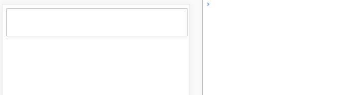

## Browserslist: caniuse-lite is outdated. Please run: npx browserslist@latest --update-db

```
yarn upgrade
```


what

>样式表


why

>渲染页面，结构和渲染分离


css 奇怪用法

> 变量，计算，伪类，伪元素


css预编译

“原生的 CSS 不支持嵌套写法, 但是我们可以使用 CSS 的扩展语言 Sass 和 Less 来实现嵌套.”，

stylus，less，sass，scss


预编译语言典型用法

> 嵌套语法、变量、函数、样式污染，vue-scope，deep，rbga,卡券 ，css hack， flex布局


css与dom

1、css并不会阻塞DOM树的解析
2、css加载会阻塞DOM树渲染
3、css加载会阻塞后面js语句的执行，不阻塞js的加载


css与兼容

页眉屏，postcss，rem，vw，

rem对于内嵌，外链，行内样式的处理


css与编译工具（gulp，webpack，grunt，vite，rollup）

gulp：gulp-minify-css，gulp-less，gulp-ruby-sass，

webpack：node-sass、style-loader、css-loader、sass-loader，postcss-loader（[Autoprefixer](https://github.com/postcss/autoprefixer) ）

vite：  less、less-loader

rollup: postcss、 rollup-plugin-postcs

```
{
  test: /\.less$/,
  use: [
    'style-loader',
    'css-loader',
    'less-loader'
  ]
}
执行顺序：链式的，所以在use数组中下面的部分会先执行，所以他们的执行顺序其实是less-loader > css-loader > style-loader

其实为啥是从右往左，而不从左往右，只是Webpack选择了compose方式，（函数组合的两种形式：一种是pipe，另一种是compose。前者从左向右组合函数，后者方向相反。）
```


less-loader原理，ast语法树


CSSReset


css规范


stylelint


psd切图


### webpack

> 编译后calc表达式丢失，采用  width: ~'calc(100% - 120px)';


### input 的 compositionstart 和 compositionend 事件（禁止非直接输入）

在 web 开发中，我们通常需要对输入的内容进行校验。这段代码虽然执行起来没有什么问题，但是会产生非直接输入，比方说我们输入“树莓派”，中间过程会输入拼音，每次输入字母都会触发input事件，然而当中文输入完成之前，都属于非直接输入。


#### 未禁止非直接输入




 

 可以看到，当我们输入 “树莓派” 时，触发了9次 input 事件，这并非是我们想要的结果，我们希望直接输入(中文输入完成)后，再触发 input 的业务逻辑，此时就需要引入其他两个事件 compositionstart 和 compositionend

事件解释
compositionstart
是指中文输入法开始输入触发，每次输入开始仅执行一次，执行的开始是 end 事件结束了才会触发

compositonupdate
是指中文输入法在输入时触发，也就是可能得到 shu’mei 这种内容，这里返回的内容是实时的，仅在 start 事件触发后触发，输入时实时触发

compositionend
是指中文输入法输入完成时触发，这是得到的结果就是最终输入完成的结果，此事件仅执行一次。
需要特别注意的是：该事件触发顺序在 input 事件之后，故而需要在此事件的处理逻辑里调用一次 input 里边的业务逻辑

#### 禁止非直接输入

// 添加标记位 lock ,当用户未输入完时，lock 为 true

```javascript
var lock = false;
var inputEle = document.getElementById('inputEle');
// input 事件中的处理逻辑, 这里仅仅打印文本
var todo = function (text) {
    console.log(text)
};
inputEle.addEventListener('compositionstart', function () {
    lock = true;
});
inputEle.addEventListener('compositionend', function (event) {
    lock = false;
    // compositionend 事件发生在 input 之后，故此需要此处调用 input 中逻辑
    todo(event.target.value);
});
inputEle.addEventListener('input', function (event) {
    // 忽略一切非直接输入，不做逻辑处理
    if (!lock) todo(event.target.value);
});
```


可以看到，此时已经过滤了全部非直接输入，只有当用户输入中文结束时才会触发 input 中的业务逻辑 ~


## 模糊匹配查询input

```javascript
<input 
    @focus="isForSearch = true" 
    debounce="100" 
    v-model="searchValue" 
    @compositionstart="searchComposition = true" 
    @compositionend="searchComposition = false" 
    type="text" 
    placeholder="请输入书名"
/>

watch: {
    searchComposition(nv) {
        if (nv == false) {
            this.searchBooks()
        }
    },
    searchValue() {
        this.searchBooks()
    },
}


methods: {
    searchBooks() {
        let nv = this.searchValue
        if (this.searchComposition || nv == this.lastSearchValue) {
            return
        }

        this.lastSearchValue = nv
        if (this.searchValue == "") {
            this.searchList = []
            return
        }
    }
}
```

## 属性操作

```
// 获取容器元素
let wrapper = document.getElementById('btnWrapper');
// 先给容器设置一个css变量并附初始值
wrapper.style.setProperty('--groove-left', '12px');
// 获取按钮元素
let btns = document.getElementsByClassName('btn');
for (let i = 0; i < btns.length; i++) {
    // 给每个按钮添加点击事件
    btns[i].addEventListener('click', function (e) {
        // 点击后，修改css变量的值
        wrapper.style.setProperty('--groove-left', `calc(12px + ${i * 50}%)`);
    })
}
```

## 文案多行省略号显示 CSS -webkit-box-orient: vertical 属性编译后丢失问题详解
```
overflow: hidden;
width: 77px;
text-align: left;
text-overflow: ellipsis;
word-break: break-all;
display: -webkit-box;
-webkit-line-clamp:2;
/* autoprefixer: ignore next */
-webkit-box-orient: vertical;
```
注意-webkit-box-orient: vertical;可能编译打包丢失，增加/* autoprefixer: ignore next */

## 判断文字是否有省略号
```
@click="toast($event, 'xxxxx')"
toast(e, msg) {
    const box = e.target
    if (
      box.scrollWidth > box.offsetWidth || 
      // 多行省略
      box.scrollHeight > box.offsetHeight 
    ){
        toastMessage(msg)
    }
}
```

## iphone，ios部分机型下高度塌陷
```
flex-shrink: 0;
```

## flex高度自适应
```
<div id="root">
  <header>
   test
  </header>
  <main>
     content
  </main>
</div>

body {
      margin: 0;
      padding: 0;
    }
    #root {
      display: flex;
      flex-direction: column;
      height: 100vh;
    }

    header {
      height: 50px;
      flex: 0 0 auto;
      background: orange;
    }

    main {
      // 高度自适应
      flex-grow: 1;
      background-color: blueviolet;
    }
```

```
flex-grow、flex-shrink、flex-basis三个属性的作用：
在flex布局中，父元素在不同宽度下，子元素是如何分配父元素空间的。

(注意：这三个属性都是在子元素上设置的，下面小编要讲的是父元素，指以flex布局的元素(display:flex))

小编这里先教一下大家如何快速记住这三个属性：

flex-basis （首先是 flex-basis ，basis英文意思是<主要成分>，所以他和width放在一起时,肯定把width干掉，basis遇到width时就会说我才是最主要的成分，你是次要成分，所以见到我的时候你要靠边站。）
flex-grow（其次是 flex-grow，grow英文意思是<扩大，扩展，增加>,这就代表当父元素的宽度大于子元素宽度之和时，并且父元素有剩余，这时，flex-grow就会说我要成长，我要长大，怎么样才能成长呢，当然是分享父元素的空间了。见下面第二个属性的内容
）
flex-shrink（最后是 flex-shrink， shrink英文意思是<收缩，>，这就代表当父元素的宽度小于子元素宽度之和时，并且超出了父元素的宽度，这时，flex-shrink就会说外面的世界太苦了，我还是回到父亲的怀抱中去吧！因此，flex-shrink就会按照一定的比例进行收缩。）
```

## flex灵活换行
```
flex-flow 属性是 flex-direction 和 flex-wrap 属性的复合属性。
flex-flow 属性用于设置或检索弹性盒模型对象的子元素排列方式。
flex-direction 属性规定灵活项目的方向。
flex-wrap 属性规定灵活项目是否拆行或拆列。 
```

## 完美解决input 类型checkbox复选框不显示的问题
> 勾选没有出现✔的样式
```
-webkit-appearance: checkbox
```
