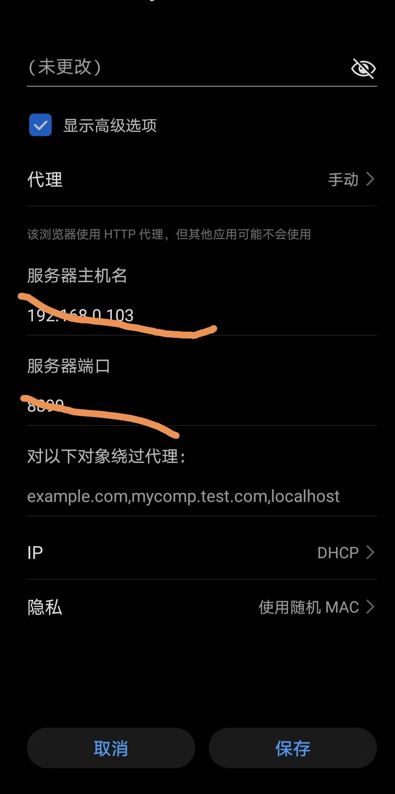
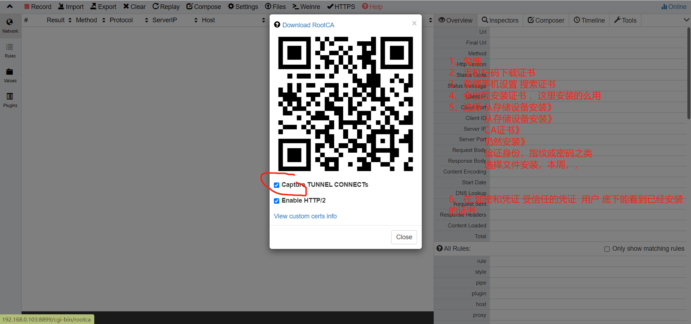

# 华为荣耀手机抓包配置

# http

在wifi网络上长安 勾选高级选项 填写代理ip和端口即可

# https

* 1、勾选 
* 2、手机扫码下载证书
* 3、荣耀手机设置 搜索证书
* 4、会出现安装证书 ，这里安装的么用
* 5、选择 从**存储设备安装》**
              从存储设备安装》
              CA证书》
              仍然安装》
              验证身份，指纹或密码之类
              选择文件安装，本周，，

6、在 加密和凭证 受信任的凭证  用户 底下能看到已经安装的证书

