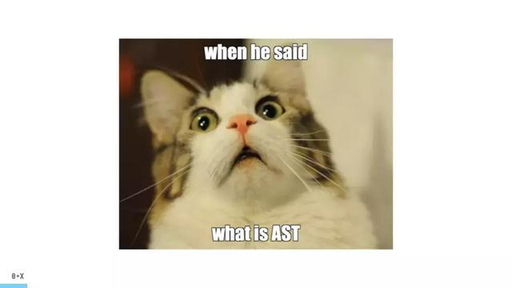
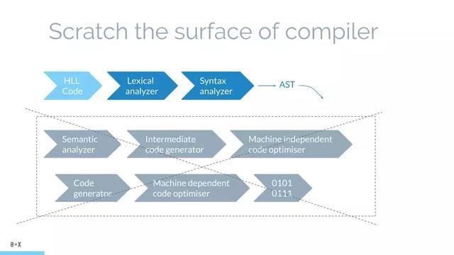
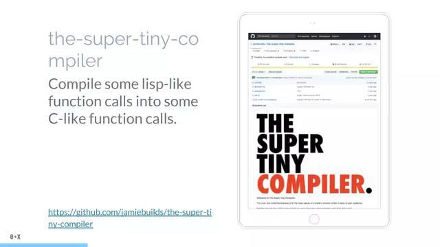
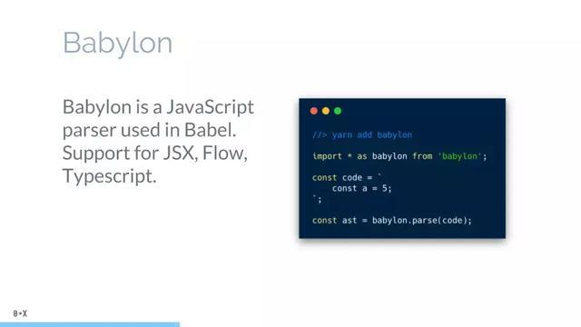
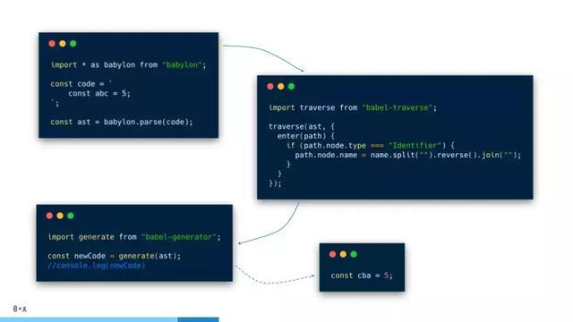
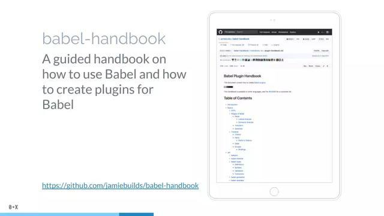
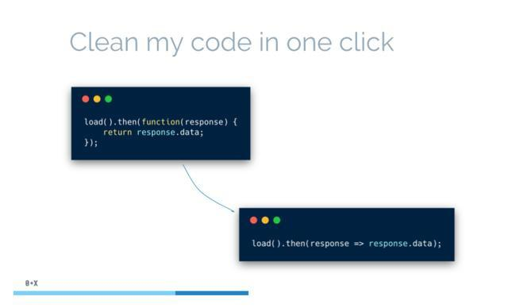
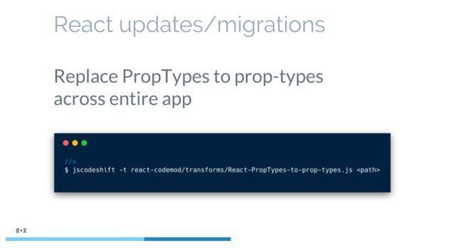
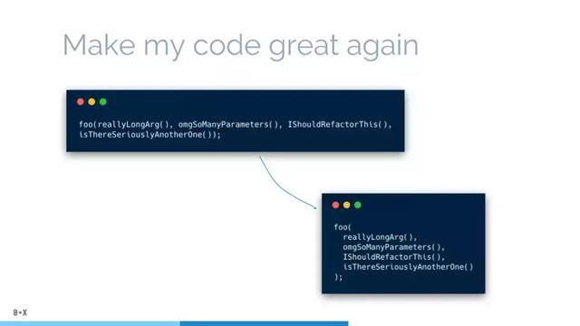
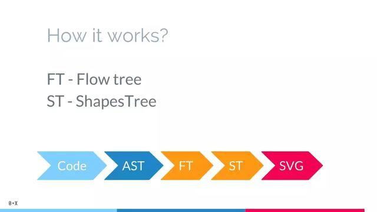

# 编程语言的实现，从AST（抽象语法树）开始

## **前言**

一直想聊一聊抽象语法树，但一直不知道如何下手。最近随意google的时候，突然发现一篇相当不错的文章。一个国外哥们写的。

原文出自《AST for JavaScript developers》

本着“学习”精神变把他的文章拜读一番，然后翻译了一下。希望这个外国小哥哥不要打我，哈哈。

## **正文**

### 为什么要谈AST（抽象语法树）?

如果你查看目前任何主流的项目中的devDependencies，会发现前些年的不计其数的插件诞生。我们归纳一下有：javascript转译、代码压缩、css预处理器、elint、pretiier，等。有很多js模块我们不会在生产环境用到，但是它们在我们的开发过程中充当着重要的角色。所有的上述工具，不管怎样，都建立在了AST这个巨人的肩膀上。

所有的上述工具，不管怎样，都建立在了AST这个巨人的肩膀上

我们定一个小目标，从解释什么是AST开始，然后到怎么从一般代码开始去构建它。我们将简单地接触在AST处理基础上，一些最流行的使用例子和工具。并且，我计划谈下我的js2flowchart项目，它是一个不错的利用AST的demo。OK，让我们开始吧。

### 什么是AST（抽象语法树）？

It is a hierarchical program representation that presents source code structure according to the grammar of a programming language, each AST node corresponds to an item of a source code.

估计很多同学会和图中的喵一样，看完这段官方的定义一脸懵逼。OK，我们来看例子：

这很简化

实际上，真正AST每个节点会有更多的信息。但是，这是大体思想。从纯文纯中，我们将得到树形结构的数据。每个条目和树中的节点一一对应。

那怎么从纯文本中得到AST呢？哇哦，我们知道当下的编译器都做了这件事前。那我们就看看一般的编译器怎么做的就可以了。

### AST要素

想做一款编译器是个比较消耗发量的事情，但幸运的是，我们无需贯穿编译器的所有知识点，最后将高级语言转译为二进制代码。我们只需要关注词法分析和语法分析。这两步是从代码中生成AST的关键所在。

第一步，词法分析，也叫做扫描scanner。它读取我们的代码，然后把它们按照预定的规则合并成一个个的标识tokens。同时，它会移除空白符，注释，等。最后，整个代码将被分割进一个tokens列表（或者说一维数组）。

当词法分析源代码的时候，它会一个一个字母地读取代码，所以很形象地称之为扫描-scans；当它遇到空格，操作符，或者特殊符号的时候，它会认为一个话已经完成了。

第二步，语法分析，也解析器。它会将词法分析出来的数组转化成树形的表达形式。同时，验证语法，语法如果有错的话，抛出语法错误。

当生成树的时候，解析器会删除一些没必要的标识tokens（比如不完整的括号），因此AST不是100%与源码匹配的，但是已经能让我们知道如何处理了。说个题外话，解析器100%覆盖所有代码结构生成树叫做CST（具体语法树）

我们最终得到的

想要学习更多关于编译器的知识？ the-super-tiny-compiler，一个贼好的项目。大概200来行代码，几乎每行都有注释。

想要自己创建门编程语言？ LangSandbox，一个更好的项目。它演示了如何创造一门编程语言。当然，设计编程语言这样的书市面上也一坨坨。所以，这项目更加深入，与the-super-tiny-compiler的项目将Lisp转为C语言不同，这个项目你可以写一个你自己的语言，并且将它编译成C语言或者机器语言，最后运行它。

我能直接用三方库来生成AST吗？ 当然可以！有一坨坨的三方库可以用。你可以访问astexplorer，然后挑你喜欢的库。astexplorer是一个很棒的网站，你可以在线玩转AST，而且除了js，还有很多其它语言的AST库。

我不得不强调一款我觉得很棒的三方库，叫做babylon。

它被用在大名鼎鼎的babel中，也许这也是它之所以这么火的原因。因为有babel项目的支持，我们可以意料到它将与时俱进，一直支持最新的JS特性，我们可以放心大胆地用，不怕以后JS又出新版导致代码的大规模重构。另外，它的API也非常的简单，容易使用。

Ok，现在你知道怎么将代码生成AST了，让我们继续，来看看现实中的用例。

### 一些例子 =》babel

第一个用例，我想谈谈代码转化，没错，就是那个货，babel。

Babel is not a ‘tool for having ES6 support’. Well, it is, but it is far not only what it is about.

经常把beble和支持es6/7/8联系起来，实际上，这也是我们经常用它的原因。但是，它仅仅是一组插件中的一个。我们也可以使用它来压缩代码，react相关语法转译（如jsx），flow插件等。

babel是一个javascript编译器。宏观来说，它分3个阶段运行代码：解析（parsing），转译（transforming），生成（generation）。我们可以给babel 一些javascript代码，它修改代码然后生成新的代码返回。那它是怎样修改代码的呢？没错！它创建了AST，遍历树，修改tokens，最后从AST中生成新的代码。

我们来从下面的demo中看下这个过程：

像我之前提到的，babel使用babylon，所以，首先，我们解析代码成AST，然后遍历AST，再反转所有的变量名，最后生成代码。完成！正如我们看到的，第一步（解析）和第三步（生成）看起来非常常规，我们每次都会做这两步。所以，babel接管处理了它俩。最后，我们最为关心的，那就是AST转译这一步了。

当我们开发babel-plugin的时候，我们只需要描述转化你AST的节点“visitors”就可以了。

将它加入你的babel插件列表中，设置你webpack的babel-loader配置或者.babelrc中的plugins即可。

如果你想要学习怎么创建你的第一个babel-plugin，可以查看Babel-handbook

### 一些例子 =》JSCodeshift

让我们继续，下一个用例，我想提到的是自动代码重构工具，以及神器JSCodeshift。

比如说你想要替换掉所有的老掉牙的匿名函数，把他们变成Lambda表达式（箭头函数）。

你的代码编辑器很可能没法这么做，因为这并不是简单地查找替换操作。这时候jscodeshift就登场了。

如果你听过jscodeshift，你很可能也听过codemods，一开始挺这两个词可能很困惑，不过没关系，接下来就解释。jscodeshift是一个跑codemods的工具。codemod是一段描述AST要转化成什么样的代码，这思想和babel的插件如出一辙。

所以，如果你想创建自动把你的代码从旧的框架迁移到新的框架，这就是一种很乃思的方式。举个例子，react 16的prop-types重构。

有很多不同的codemodes已经创建了，你可以保存你需要的，以免手动的修改一坨坨代码，GitHub就在这，搞起来： github.com/facebook/js… github.com/reactjs/rea…

### 一些例子 =》Prettier

最后一个用例，我想要提到Prettier，因为可能每个码农都在日常工作中用到它。

Prettier 格式化我们的代码。它调整长句，整理空格，括号等。所以它将代码作为输入，修改后的代码作为输出。听起来很熟悉是吗？当然！

思路还是一样。首先，将代码生成AST。之后依然是处理AST，最后生成代码。但是，中间过程其实并不像它看起来那么简单。

同样，如果你想学习更多在美化打印背后理论，这里有一本你可以深入的书 《A prettier printer》。

### 作者的库 =》 js2flowchart

文章迎来尾声，我们继续，今天最后一件事，我想提及的就是我的库，叫做js2flowchart(4.5 k stars 在 Github)。

这个小哥很有意思，没有贴链接~大家感兴趣的话，可以GitHub搜索一下

顾名思义，它将js代码转化生成svg流程图

这是一个很好的例子，因为它向你展现了你，当你拥有AST时，可以做任何你想要做的事。把AST转回成字符串代码并不是必要的，你可以通过它画一个流程图，或者其它你想要的东西。

js2flowchart使用场景是什么呢？通过流程图，你可以解释你的代码，或者给你代码写文档；通过可视化的解释学习其他人的代码；通过简单的js语法，为每个处理过程简单的描述创建流程图。

马上用最简单的方式尝试一下吧，去线上编辑看看 js-code-to-svg-flowchart

你也可以在代码中使用它，或者通过CLI，你只需要指向你想生成SVG的文件就行。而且，还有VS Code插件（链接在项目readme中）

那么，它还能做什么呢？哇哦，我这里就不废话了，大家有兴趣直接看这个项目的文档吧。

OK，那它是如何工作的呢？

首先，解析代码成AST，然后，我们遍历AST并且生成另一颗树，我称之为工作流树。它删除很多不重要的额tokens，但是将关键块放在一起，如函数、循环、条件等。再之后，我们遍历工作流树并且创建形状树。每个形状树的节点包含可视化类型、位置、在树中的连接等信息。最后一步，我们遍历所有的形状，生成对应的SVG，合并所有的SVG到一个文件中。

## **结尾**

最后，再次感谢这个国外的小哥哥！一篇相当高质量，且很系统的文章~~