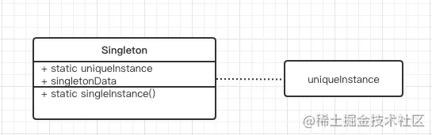

##  含义
单例模式在前端开发过程中非常常见，通俗来说就是某个类只能有一个实例，只能实例化一次，之后所有实例化的操作都是返回之前已经实例化的实例



## 应用场景

### vuex
```
if (!Vue && typeof window !== 'undefined' && window.Vue) {
  install(window.Vue)
}

function install (_Vue) {
  if (Vue && _Vue === Vue) {
    console.error('[vuex] already installed. Vue.use(Vuex) should be called only once.')
    return
  }
  Vue = _Vue
}

```

### Message组件
main.vue
```
<template>
    <div v-show="visible">message组件</div>
</template>

<script type="text/babel">
export default {
    data() {
        return {
            visible: false
        };
    },
    methods: {
        close() {
            this.visible = false;
        },
        show() {
            this.visible = true;
        }
    }
};
</script>


```

main.js
```
import Vue from "vue";
import Main from "./main.vue";
let MessageConstructor = Vue.extend(Main);

class Message {
    /** 
     * 展示 message组件
     */
    show() {
        this.instance.show()
    }

    /** 
     * 关闭 message组件
     */
    close() {
        this.instance.close()
    }
	
    /** 
     * 单例
     */
    static getInstance() {
        if(!this.instance) {
            let instance = new MessageConstructor();
            this.instance = instance;
            instance.$mount();
            document.body.appendChild(instance.$el);
        }

        return this.instance
    }
}


Message.getInstance().show();
Message.getInstance().close();

```